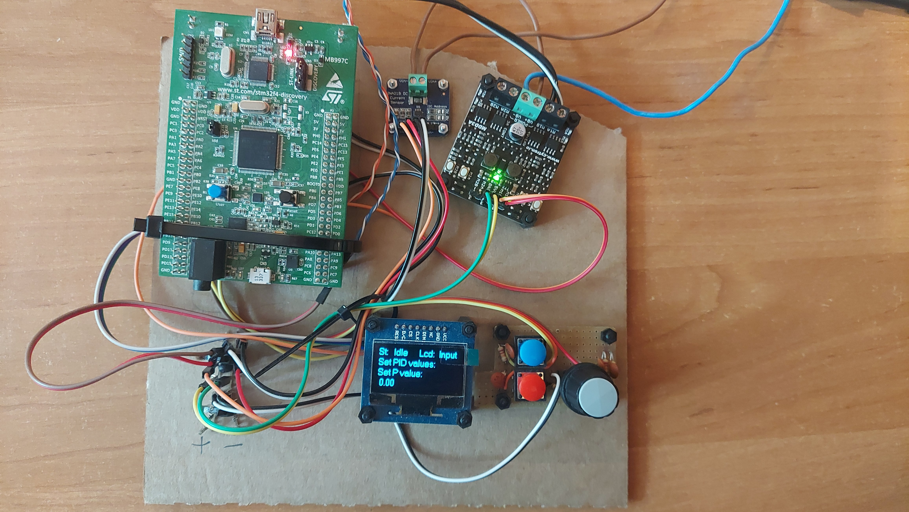
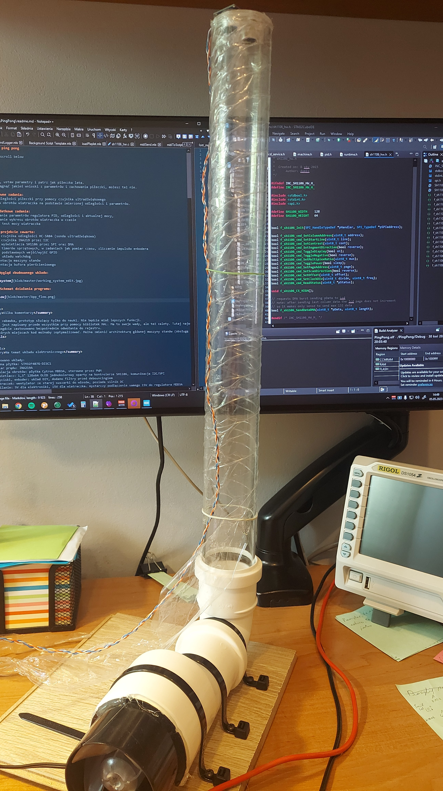
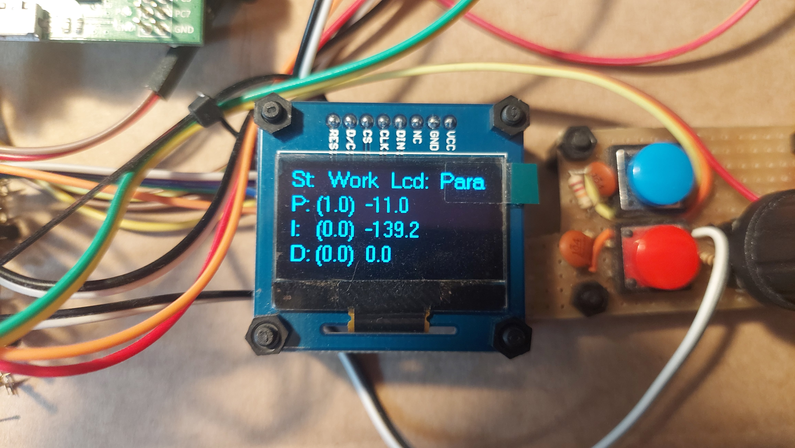
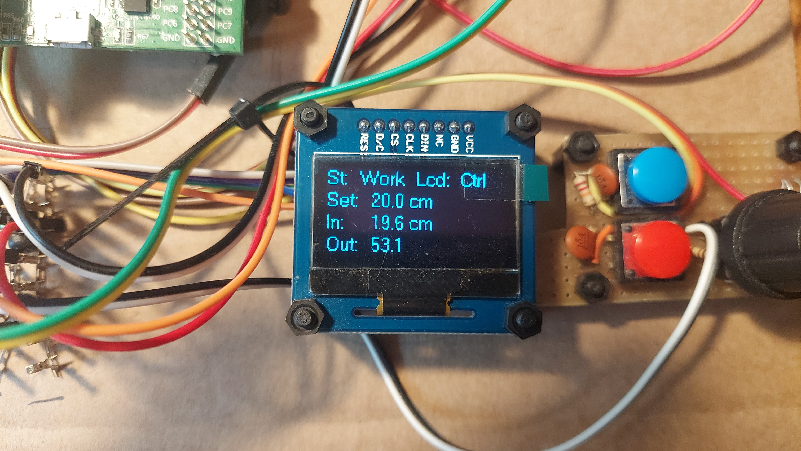

# Lewitujący ping pong

For english scroll below

### PL:

Włącz układ, ustaw parametry i patrz jak piłeczka lata.
Możesz wyciągnąć jakieś wnioski z parametrów i zachowania piłeczki, możesz też nie.

#### 1. Główne zadania:
- Pomiar odległości piłeczki przy pomocy czujnika ultradźwiękowego
- Regulacja obrotów wiatraczka na podstawie zmierzonej odległości i parametrów.
- Parametry do ustawienia: P, I, D(od regulatora), wysokość piłeczki w rurze (5-45cm)

#### 2. Dodatkowe zadania:
- Wyświetlanie parametrów regulatora PID, odległości i aktualnej mocy,
- Wyświetlanie wykresu obrotów wiatraczka w czasie
- Pomiar i test mocy silniczka wiatraczka

#### 3. W projekcie zawarto:
- Obsługa czujnika odległości HC-SR04 (sonda ultradźwiękowa)
- Obsługa czujnika INA219 przez I2C
- Obsługa wyświetlacza SH1106 przez SPI oraz DMA
- Obsługa timerów sprzętowych, w zadaniach jak pomiar czasu, zliczanie impulsów enkodera
- Obsługa podstawowych wejść/wyjść GPIO
- Obsługa układu watchdog
- Implementacja maszyny stanów
- Implementacja bufora pierścieniowego

#### 4. Wygląd zbudowanego układu:

#### 5. Działanie programu:

W folderze assets znajdują się krótkie filmy, które pokazują jak układ działa przy różnych parametrach.

Kilka komentarzy

Jest to zabawka, prototyp służący tylko do nauki. Nie będzie miał lepszych funkcji.
Program jest napisany przede wszystkim przy pomocy bibliotek HAL. Ma to swoje wady, ale też zalety. Tutaj największą zaletą była prosta nauka układu.
Gdzieniegdzie zastosowano bezpośrednie odwołania do rejestru.
W niektórych miejscach kod możnaby zoptymalizować. Można zmienić architekturę głównej maszyny stanów (obsługę przycisków przełożyć do wewnętrznych stanów), ale uważam, że na ten moment kod jest kompletny.

Na temat układu elektronicznego

Zastosowano układy:
- Główna płytka: STM32F407G-DISC1
- Pomiar prądu: INA219A
- Regulacja obrotów: płytka Cytron MDD3A, sterowne przez PWM
- Wyświetlacz: 1,3" 128x64 OLED jednokolorowy oparty na kontrolerze SH1106, komunikacja I2C/SPI
- Przyciski, enkoder: układ DIY, dodano filtry przed debouncingiem
- Wiatraczek: wentylator ze starej suszarki do włosów, posiada silnik DC
- Zasilanie: 5V dla elektroniki, 15V dla wiatraczka. Wystarczy podłączenie samego 15V do regulatora MDD3A

Opis poszczególnych plików (w katalogu Mine)

- circ_buffer.h
	- Implementacja bufora pierścieniowego.
	- Jeden długi wektor pamięci, bez używania sterty i malloc()
	- Do kolejki wkłada się wskaźnik void, odbiera tak samo.
	- Funkcje jako argument przyjmują bufor, więc w całym programie może być więcej niż jeden bufor.

- gui.h
	- Najwyższa (abstrakcyjnie) biblioteka obsługująca wyświetlacza
	- gotowe funkcje rysujące cały wykres czy inne dane

- lcd_service.h
	- Druga biblioteka obsługująca wyświetlacza
	- Zawiera funkcje inicjalizujące, rysujące linie, jeden piksel itp.
	- Funkcja "Callback" realizuje główną transmisję danych do wyświetlacza

- sh1106.h
	- Najniższa obsługa wyświetlacza,
	- Zawiera podstawowe funkcje inicjalizujące i wysyłające komendy do wyświetlacza
	- Komendy są wysyłane przez odpytywanie
	- Główne dane to wektory po 128 bajtów, są wysyłane przez DMA
	
- ina219.h
	- Obsługa układu INA219A
	- komunikacja przez I2C, przez odpytywanie (przepływa rzadko mało danych, nie potrzeba przerwań)
	- zawiera funkcje inicjalizujące i służące do pomiaru napięcia/prądu/mocy.

- machine.h
	- Obsługa wiatraczka i czujnika odległości
	- Realizacja przez dwa timery (jeden PWM mode, drugi Output Compare i Input Capture)
	- Czujnik potrzebuje minimum ~5ms na pomiar, więc zastosowano tu przerwania
	- Funkcje callback są do wstawienia w przerwania timerów, obsługują czujnik odległości

- pid.h
	- Implementacja regulatora PID
	- Zawiera jedną funkcję do obliczenia wyjścia
	- Zastosowano typy float, ponieważ mikrokontroler zawiera układ FPU.

- runtime.h
	- Zawiera funkcje znajdujące się w głównych stanach programu
	- Wydzielono je dla lepszej przejrzystości kodu
	
- main.c (w katalogu Core)
	- zawiera główną pętlę programu i dodatkowe funkcje
	- główna zasada działania to maszyna stanów oparta na wskaźnikach na funkcję,
	- w stanach 'idle' i 'work' dodatkowe maszyny stanów oparte na switch case
	- funkcje 'idle' i 'work' (w szczególności) mogą wyglądać na zbyt duże, ale znajdują się tam główne funkcje programu i rozdzielenie ich na mniejsze nie poprawiłoby za bardzo czytelności
	- w stanie 'work' program realizuje cztery główne zadania przy pomocy timerów programowych (zadania są ze sobą powiązane): wyświetlanie nagłówka LCD, strony (Param, Ctrl, Chart) LCD, obsługa czujnika i wiatraczka, test wiatraczka
	- Wiatraczek musi ustabilizować obroty, zanim może zostać zmierzony pobór prądu, więc porównuje się ostatnią średnią z wartości PWM wiatraczka z aktualnym PWM
	- w pliku znajdują się jeszcze funkcje debugujące DWT, służyły do sprawdzania długości wykonywania konkretnych zadań.

### ENG:

Turn of the machine, set the parameters and look how the ball levitates.
You can take some thoughts from set parameters or behaviour of the ball, you can also not.

#### 1. Main tasks:
- Distance measurement of the ball with an ultrasonic sensor
- Fan RPM regulation based on measured ball distance and set parameters
- Parameters which can be set: P, I, D(from regulator), height of the ball (5-45cm)

#### 2. Additional tasks:
- Displaying PID parameters, current distance and motor power
- Displaying RPM vs time chart
- Power measurement and test of the fan motor

#### 3. In the project you can find:
- Use of an HC-SR04 ultrasonic sensor,
- Use of INA219A sensor via I2C
- Use of a LCD display with SH1106 controller via SPI and DMA
- Use of different hardware timers for task such as time counting and encoder impulses counting
- Use of GPIOs
- Use of independent watchdog
- Implementation of a state machine
- Implementation of a circular buffer

#### 4. How the built system looks like:

Check Point 4. in PL section

#### 5. How the system works:

Check Point 5. in PL section

In the assets folder there are short clips to visualize how the system works at different parameters.

Few comments

It is a toy, a prototype for only learning purposes. It wouldn't get any other functions.
The code is written mostly by using HAL libraries. It has some disadvantages, but also advantages. The ease of learning was the key why the HAL libraries were used.
In some places there are direct register manipulation.
Some blocks of code could be optimized. The architecture of state machine could be changed (to not use buttons as external events), but I think that in this moment the code is good enough.

Few words about the electronics and PCB

In this project were used:
- Main board: STM32F407G-DISC1
- Power measurement: INA219A
- Speed regulation: Cytron MDD3A PCB, controlling with PWM
- Display: 1,3" 128x64 monochromatic OLED, SH1106 controller, communication with I2C/SPI
- Buttons, encoder: DIY PCB, added debouncing high pass filters
- Fan: from old hair dryer, it has DC motor
- Power supply: 5V for electronics, 15V for the fan. Only 15V for MDD3A is needed for proper work

Detailed file description (in Mine catalogue)

- circ_buffer.h
	- Implementation of circular buffer
	- One long memory vector, without using memory heap and malloc()
	- Enqueueing takes a void pointer, deqeueueing returns in the same manner
	- One of functions argument is the buffer itself, so there can be more than one buffer

- gui.h
	- Highest (on abstraction) library for LCD support
	- Functions such as draw whole chart or draw all the data on LCD

- lcd_service.h
	- Middle library which supports the LCD
	- Functions such as draw line, draw one pixel etc.
	- Main data transfer is generated in the callback function

- sh1106.h
	- The lowest LCD library specific for the sh1106 controller
	- It contains basic functions and commands which are sent to LCD
	- Command are transmitted through polling
	- Main data are 128bytes long vectors, they are sent via DMA
	
- ina219.h
	- Support for INA219A sensor
	- communication via I2C, used polling (low data transfer rate, no need to use interrupts)
	- Contains init functions and for measuring voltage/current/power

- machine.h
	- Support for the fan and distance sensor
	- Implementation with two timers, first on PWM mode, second one for Output Compare and Input Capture
	- distance sensor needs minimum ~5ms for one measurement, so interrupt routine makes things easier
	- Callback functions are used in timer IRQs, needed for proper sensor work

- pid.h
	- Implementation of PID regulator
	- It contains one function for calculating the PID output
	- There are used float types, that is because this MCU contains FPU which supports float calculation with no cycle penalty

- runtime.h
	- It contains functions called by main states of the program
	- They were seperated due to better code readability
	
- main.c (in Core catalogue)
	- Contains main program loop and additional miscellanous functions
	- Main program runs by state machine architecture implemented with function pointers
	- In 'idle' and 'work' state there are additional internal state machines built on switch case statement
	- 'idle' and (especially) 'work' states seems to look to be overwhelmed, but this functions are realizing main program tasks and separation for smaller fuctions calls wouldn't improve readability
	- in 'work' state the loop realizes four main tasks trigerred by software timers (tasks are linked with themselves): display LCD heading, LCD pages (Param, Ctrl, Chart), sensor and fan calculation, fan test
	- fan motor has to have stabilized RPM before testing the power draw, so it is trigered only if PWM from motor is near last mean PWM value
	- in the file there are also DWT debug functions which helped developing the code

